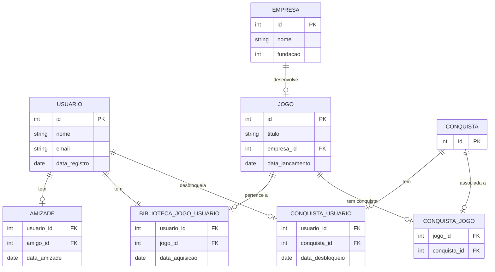

# Projeto 2: Sistema de Plataforma de Jogos

Feito por: Bruno Arthur Basso Silva | Gabriela Molina Ciocci 
 
RA: 22.123.067-5 | 22.222.032-9 
 
Disciplina: CC5232 - Banco de Dados
 
Coordenador(a): Leonardo Anjoletto Ferreira
 
Ciclo: 5° Semestre. 
 
Curso: Ciência da Computação
 
Universidade: Centro Universitário FEI

======================================================================================================================================================

## INFORMAÇÕES NECESSÁRIAS

Certifique-se de criar o Banco de Dados e respectivas tabelas antes de utilizar o código.
 
O arquivo que contém as Queries de criação de tabelas no Banco de Dados chama-se "Queries SQL para Criação de Tabelas.txt".
 
O arquivo que contém as Queries e Questões de Álgebra Relacional criadas para esse projeto chama-se "Queries SQL para Álgebra Relacional.txt".
 
#### Obs: foram feitas mais de 10 perguntas.

======================================================================================================================================================

## CÓDIGO PARA CRIAÇÃO DE DADOS ALEATÓRIOS

Para utilizar o código, é obrigatório que os arquivos de texto estejam na mesma pasta que o programa em Python, são eles:

   -> usuarios.txt
    
   -> jogos.txt
    
   -> empresas.txt
    
   -> conquistas.txt

Ao baixar todos os arquivos e colocá-los no mesmo local, então você poderá executar o código.
 
Para definir a quantidade de cada item que será gerado, você precisará descer até as últimas linhas do código onde estão localizadas as variáveis que armazenam o valor de cada item que será gerado.
 
Após definir os valores desejados, você poderá rodar o programa.
 
Neste momento, será mostrado um menu contendo todas as informações dos alunos envolvidos e da disciplina.
 
Ao apertar enter, o programa irá gerar dados aleatórios e criará um novo arquivo de texto contendo todos os itens gerados:

   -> codeSQL.txt

Você poderá fechar o programa após a criação do arquivo.
 
Neste arquivo contém as Queries para adição dos dados no banco de dados.
 
Para adicioná-las, basta abrir o arquivo "codeSQL.txt", copiar todo seu conteúdo e colar no terminal do SQL.

======================================================================================================================================================

